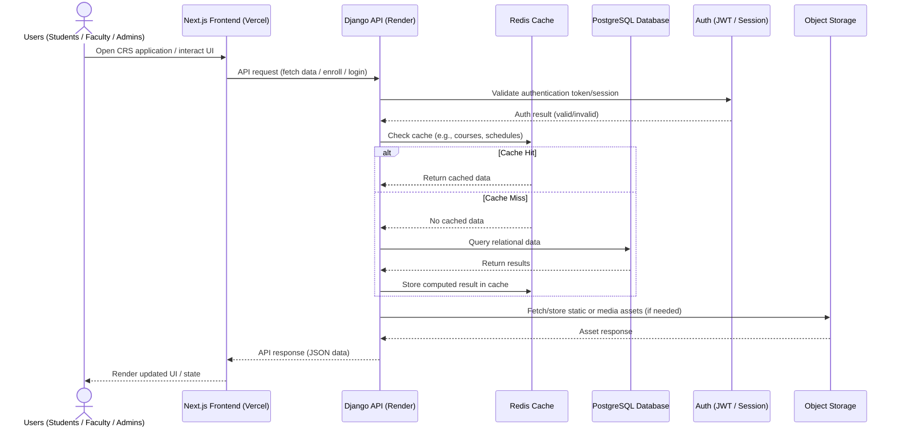
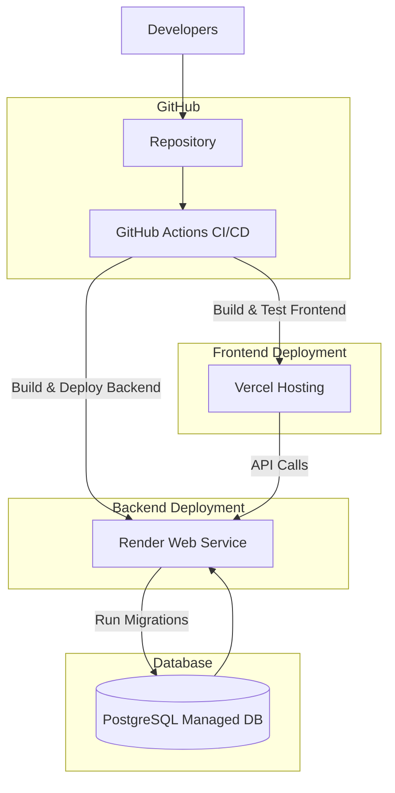
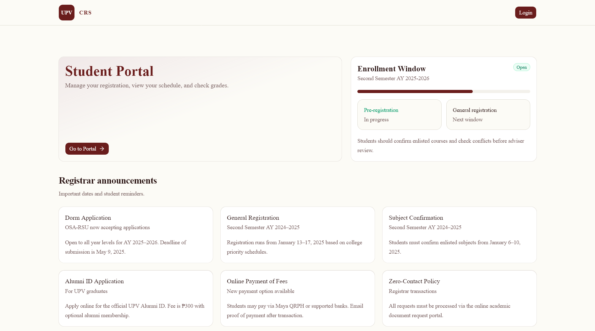
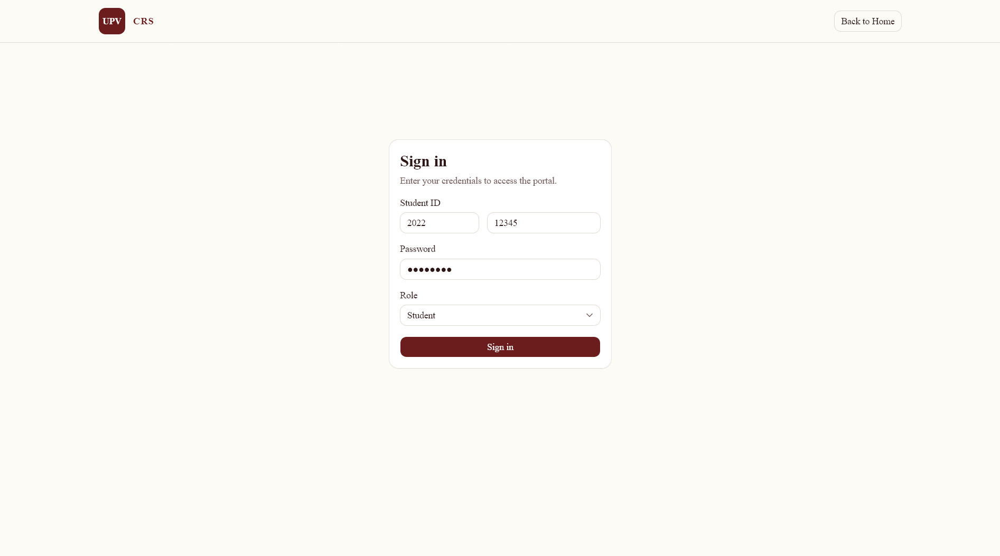
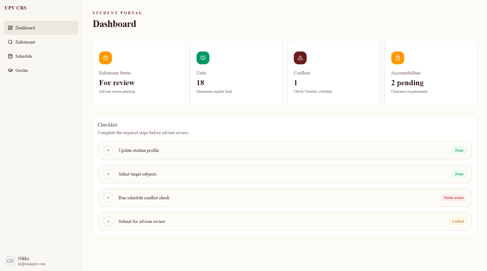
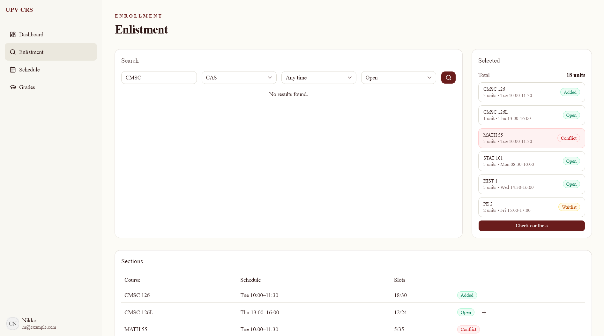
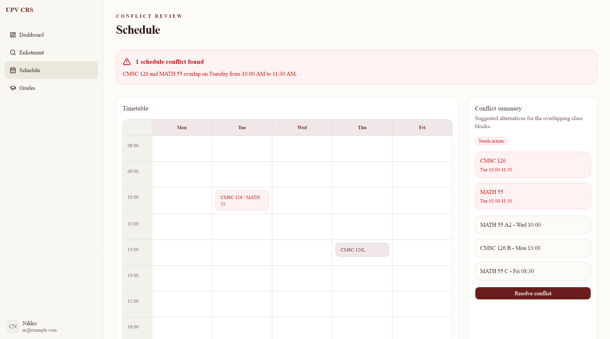
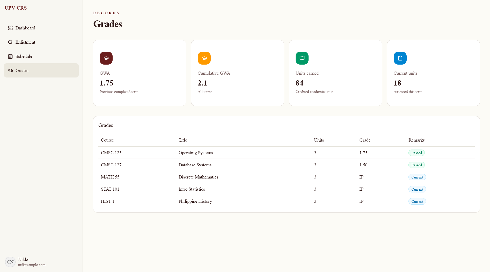

<h3>UPV CRS</h3>

_University of the Philippines Visayas Computer Registration System_

---

## Team

- Jemarco Briz
- Dejel Cyrus De Asis
- John Romyr Lopez
- Andrian Lloyd Maagma

---

## System Summary

### System Overview

The UPV Computerized Registration System (CRS) 2.0 is a university-scale academic registration platform designed to support enrollment, schedule management, and academic record interaction for the entire University of the Philippines Visayas community.

The system operates under predictable but highly bursty load patterns, primarily driven by academic enrollment periods where a large fraction of the user base (estimated ~3000-3500 students, alongside faculty and administrative staff) may simultaneously access and perform write-heavy operations within short time windows.

This creates a system with the following defining characteristics:

- **Strict correctness constraints over raw performance**. Incorrect enrollment state is considered a system failure even if performance is acceptable

- **High concurrency during enrollment windows**. Many users attempting slot reservations and course enrollments within seconds of each other

- **Strong consistency requirements for enrollment data**. Prevent over-enrollment, duplicate registration, and race conditions

- **Read-heavy baseline workload outside enrollment periods**. Schedule viewing, course browsing, and dashboard access dominate normal usage

- **Write contention concentrated on a small subset of operations**. Primarily course enrollment, section assignment, and schedule locking

The system is therefore designed as a transactionally consistent, web-based distributed application, where correctness of enrollment operations is prioritized over horizontal scalability complexity.

---

### Target Audience

- Undergraduate and graduate students
- Faculty members
- Administrative staff (registrar and department coordinators)

---

### Diagram

---

## Technology Stack

### Frontend Tools

**Language: TypeScript**

- Prevents runtime data shape errors.
- Enforces consistent API contracts between frontend and backend, reducing integration mismatches.
- Improves maintainability in a multi-developer academic system where schema changes are frequent.

**UI Library: React**

- Efficient UI updates under frequent state changes.
- Component reuse reduces duplication.
- Supports complex conditional rendering.

**Framework: Next.js**

- Enables hybrid rendering (SSR/CSR), improving initial load time for heavy pages.
- Simplifies routing for role-based access.
- Improves performance under high read traffic during enrollment peaks via pre-rendering and caching strategies.

**Styling: TailwindCSS**

- Reduces CSS complexity in a large multi-page system with repeated UI patterns.
- Enables rapid iteration during UI adjustments for academic workflows (forms, tables, dashboards).
- Minimizes stylesheet conflicts across distributed components.

**Component Library: shadcn/ui**

- Ensures consistent UI behavior across pages.
- Provides accessible base components without heavy framework lock-in.
- Allows direct control over critical UI logic without black-box abstractions.

**Data Fetching: TanStack Query**

- Prevents redundant API calls during high traffic.
- Provides caching + request deduplication, reducing backend load during enrollment spikes.
- Ensures UI consistency for server state.

**State Management: Redux Toolkit**

- Centralizes global state.
- Ensures predictable state transitions.
- Useful for cross-component synchronization.

**Validation: Zod**

- Enforces strict schema validation before API submission (critical for preventing invalid enrollments).
- Shared validation logic reduces mismatch between frontend and backend rules.
- Prevents malformed payloads from reaching transactional backend operations.

**Form Handling: React Hook Form**

- Minimizes re-render overhead in large forms.
- Efficient handling of dynamic form fields.
- Improves responsiveness under complex input validation rules.

**Linting & Formatting: ESLint + Prettier**

- Prevents inconsistent code patterns across team members.
- Reduces merge conflicts and logic inconsistencies in shared modules.
- Enforces uniform structure for long-term maintainability.

**Package Management: pnpm**

- Deterministic dependency resolution avoids "works on my machine" issues.
- Efficient storage and install speed important for CI/CD pipelines.
- Better handling of large dependency trees in React/Next.js ecosystems.

---

### Backend Tools

**Runtime: Python**

- Fast development of academic CRUD-heavy systems with complex relational logic.
- Strong ecosystem for transactional workflows and data processing.
- Readable syntax reduces onboarding cost for multi-developer teams.

**Framework: Django**

- Built-in ORM ensures safe transactional operations for enrollment (critical correctness requirement).
- Admin panel accelerates internal management workflows (registrar operations).
- Strong ACID-aligned design reduces risk of inconsistent states.

**API Layer: Django REST Framework (DRF)**

- Standardized API layer ensures consistent request/response structure.
- Integrates tightly with Django ORM, reducing custom backend complexity.
- Supports authentication and permission layers required for role-based access control.

**Authentication: JWT / Session-based Hybrid Model**

- JWT supports stateless scaling for frontend-heavy API usage.
- Sessions are retained for sensitive admin and registrar workflows requiring tighter control.
- Hybrid approach balances scalability and security requirements.

**Caching: Redis**

- Reduces database load during enrollment peaks by caching frequently accessed data (courses, schedules).
- Prevents repeated expensive joins during schedule browsing.
- Acts as a buffer layer under burst traffic conditions.

**Web Server: Gunicorn + Nginx**

- Gunicorn efficiently handles concurrent Python worker processes.
- Nginx provides load balancing, TLS termination, and static file optimization.
- Separation improves stability under high enrollment traffic bursts.

**Code Quality: Ruff (Python)**

- Reduces risk of subtle bugs.
- Enforces backend code consistency and detects potential logic errors early.
- Replaces slower linting pipelines, improving CI speed.

**Dependency Management: Poetry**

- Ensures reproducible backend environments across dev and production.
- Prevents dependency drift that could break production enrollment logic.
- Simplifies dependency locking for CI/CD pipelines.

---

### Database

**Database Model: Relational (SQL-based)**

- Relational structure naturally models academic dependencies (prerequisites, sections, schedules).

**DBMS: PostgreSQL**

- ACID compliance is essential to prevent over-enrollment, duplicate registrations, etc.
- Strong transaction isolation prevents race conditions during simultaneous enrollment attempts.
- Supports row-level locking, critical during high-contention enrollment windows.

---

### Other Tools

**Version Control: Git (GitHub)**

- Collaborative development workflow
- Code review and rollback capabilities

**Containerization: Docker**

- Standardized deployment across development and production
- Eliminates environment drift issues

**CI/CD: GitHub Actions**

- Automated testing and deployment pipeline
- Ensures consistency across environments

---

## Hosting and Deployment

### Deployment Architecture

The system follows a decoupled frontend-backend architecture with managed cloud hosting services:

#### Vercel (Frontend)

- Edge CDN improves performance for read-heavy dashboard and schedule pages.
- Automatic scaling handles sudden spikes during enrollment periods.
- Optimized for Next.js SSR/ISR workloads.

#### Render (Backend)

- Managed deployment reduces operational overhead for Django services.
- Supports scaling during enrollment spikes.
- Simplifies integration with PostgreSQL and Redis services.

#### PostgreSQL (Managed)

- Ensures database reliability without self-managed infrastructure risk.
- Provides backups and failover support critical for academic data integrity.

#### S3-Compatible Storage

- Offloads static/media files from backend, reducing server load.
- Ensures durable storage for documents and assets.

---

### Scalability and Reliability

The system is designed for burst-heavy academic workloads, particularly enrollment periods.

- Frontend scales automatically via CDN distribution
- Backend scales vertically (primary approach) with optional horizontal scaling if required
- Database is the primary constraint under peak load and is optimized for transactional integrity
- Redis caching is introduced selectively for read-heavy endpoints

Assumption: System bottleneck is expected at the database transaction layer during enrollment, not at the frontend or network layer.

---

### Security Model

- TLS encryption for all traffic (HTTPS enforced)
- Role-based access control (student, faculty, admin)
- Strict input validation at both frontend and backend layers
- Protection against common web vulnerabilities (CSRF, XSS, SQL injection)
- Environment-based secret management

---

### Deployment Workflow

---

1. Code pushed to GitHub repository
2. CI pipeline executes:
   - Linting
   - Unit tests
   - Build validation

3. Frontend automatically deployed to Vercel
4. Backend automatically deployed to Render
5. Database migrations executed as part of backend deployment
6. Health checks validate system availability post-deployment

---

## Mockups

Access: <https://cmsc-126-activity-unit5-unit6.vercel.app/>

### Homepage

### Login Page

### Student Dashboard

### Enlistment

### Schedule / Conflict Check

### Grades

