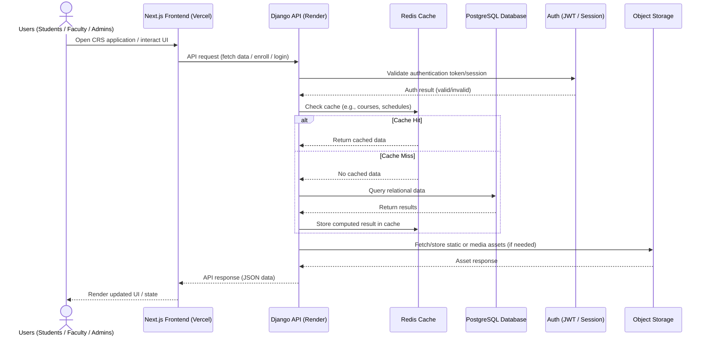
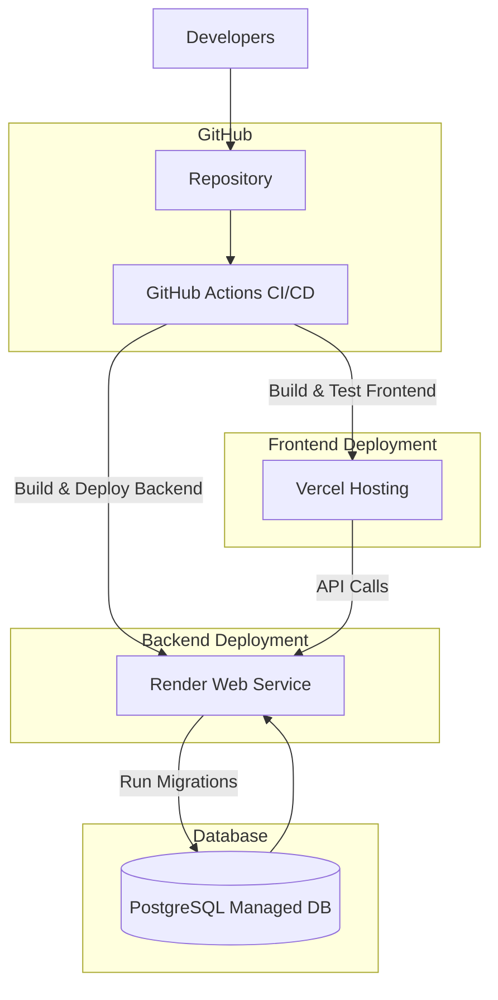

<h3>UPV CRS</h3>

_University of the Philippines Visayas Computer Registration System_

---

## Team

- Jemarco Briz
- Dejel Cyrus De Asis
- John Romyr Lopez
- Andrian Lloyd Maagma

---

## System Summary

### System Overview

The UPV Computerized Registration System (CRS) 2.0 is a university-scale academic registration platform designed to support enrollment, schedule management, and academic record interaction for the entire University of the Philippines Visayas community.

The system operates under predictable but highly bursty load patterns, primarily driven by academic enrollment periods where a large fraction of the user base (estimated ~3000-3500 students, alongside faculty and administrative staff) may simultaneously access and perform write-heavy operations within short time windows.

This creates a system with the following defining characteristics:

- **Strict correctness constraints over raw performance**. Incorrect enrollment state is considered a system failure even if performance is acceptable

- **High concurrency during enrollment windows**. Many users attempting slot reservations and course enrollments within seconds of each other

- **Strong consistency requirements for enrollment data**. Prevent over-enrollment, duplicate registration, and race conditions

- **Read-heavy baseline workload outside enrollment periods**. Schedule viewing, course browsing, and dashboard access dominate normal usage

- **Write contention concentrated on a small subset of operations**. Primarily course enrollment, section assignment, and schedule locking

The system is therefore designed as a transactionally consistent, web-based distributed application, where correctness of enrollment operations is prioritized over horizontal scalability complexity.

---

### Target Audience

- Undergraduate and graduate students
- Faculty members
- Administrative staff (registrar and department coordinators)

---

### Diagram

---

## Technology Stack

### Frontend Tools

**Language: TypeScript**

- Enforces type safety for schedule and enrollment data models
- Reduces runtime errors in complex UI state transitions
- Supports maintainable multi-developer architecture

**UI Library: React**

- Component-based architecture suitable for dashboard-heavy systems
- Efficient UI updates for dynamic enrollment states

**Framework: Next.js**

- Provides routing, SSR, and optimized client-server integration
- Enables separation of public vs authenticated system surfaces

**Styling: TailwindCSS**

- Utility-first styling for rapid iteration
- Reduces CSS maintenance overhead in multi-component systems

**Component Library: shadcn/ui**

- Accessible base components without architectural lock-in
- Supports customization for institutional branding requirements

**Data Fetching: TanStack Query**

- Centralized server-state management
- Reduces redundant API calls during high traffic periods

**State Management: Redux Toolkit**

- Global state consistency for authentication and enrollment flow
- Predictable state transitions for complex UI interactions

**Validation: Zod**

- Shared schema validation between frontend and backend
- Prevents invalid enrollment and scheduling payloads

**Form Handling: React Hook Form**

- Efficient handling of complex enrollment forms
- Minimizes re-render overhead under large forms

**Linting & Formatting: ESLint + Prettier**

- Ensures consistent codebase across contributors
- Reduces integration issues during collaboration

**Package Management: pnpm**

- Deterministic dependency resolution
- Efficient monorepo-friendly structure

---

### Backend Tools

**Runtime: Python**

- Rapid backend development for academic systems
- Strong ecosystem for structured data processing

**Framework: Django**

- Provides built-in authentication, ORM, and admin interface
- Strong transactional consistency model for relational data

**API Layer: Django REST Framework (DRF)**

- Standardized API abstraction layer
- Integrates tightly with Django ORM and auth system

**Authentication: JWT / Session-based Hybrid Model**

- JWT for stateless API access (frontend decoupling)
- Session-based fallback for admin and internal tools

**Caching: Redis**

- Improves performance for frequently accessed course and schedule data
- Reduces database load during enrollment peaks

**Web Server: Gunicorn + Nginx**

- Gunicorn handles application process management
- Nginx handles TLS termination, routing, and static assets

**Code Quality: Ruff (Python)**

- Static analysis and formatting enforcement
- Early detection of backend logic issues

**Dependency Management: Poetry**

- Reproducible Python environments
- Simplified dependency resolution

---

### Database

**Database Model: Relational (SQL-based)**

- Required due to structured academic relationships (students, courses, prerequisites)

**DBMS: PostgreSQL**

- Strong ACID guarantees for enrollment correctness
- Supports transactional locking required for concurrent registration
- Efficient handling of relational constraints and joins

---

### Other Tools

**Version Control: Git (GitHub)**

- Collaborative development workflow
- Code review and rollback capabilities

**Containerization: Docker**

- Standardized deployment across development and production
- Eliminates environment drift issues

**CI/CD: GitHub Actions**

- Automated testing and deployment pipeline
- Ensures consistency across environments

---

## Hosting and Deployment

### Deployment Architecture

The system follows a decoupled frontend-backend architecture with managed cloud hosting services:

- Frontend: Vercel-hosted Next.js application
- Backend: Render-hosted Django API service
- Database: Managed PostgreSQL (Render)
- Object storage: S3-compatible storage

---

### Scalability and Reliability

The system is designed for burst-heavy academic workloads, particularly enrollment periods.

- Frontend scales automatically via CDN distribution
- Backend scales vertically (primary approach) with optional horizontal scaling if required
- Database is the primary constraint under peak load and is optimized for transactional integrity
- Redis caching is introduced selectively for read-heavy endpoints

Assumption: System bottleneck is expected at the database transaction layer during enrollment, not at the frontend or network layer.

---

### Security Model

- TLS encryption for all traffic (HTTPS enforced)
- Role-based access control (student, faculty, admin)
- Strict input validation at both frontend and backend layers
- Protection against common web vulnerabilities (CSRF, XSS, SQL injection)
- Environment-based secret management

---

### Deployment Workflow

---

1. Code pushed to GitHub repository
2. CI pipeline executes:
   - Linting
   - Unit tests
   - Build validation

3. Frontend automatically deployed to Vercel
4. Backend automatically deployed to Render
5. Database migrations executed as part of backend deployment
6. Health checks validate system availability post-deployment

---

## Mockups

Access: <https://cmsc-126-activity-unit5-unit6.vercel.app/>

### Homepage

### Login Page

### Student Dashboard

### Enlistment

### Schedule / Conflict Check

### Grades

